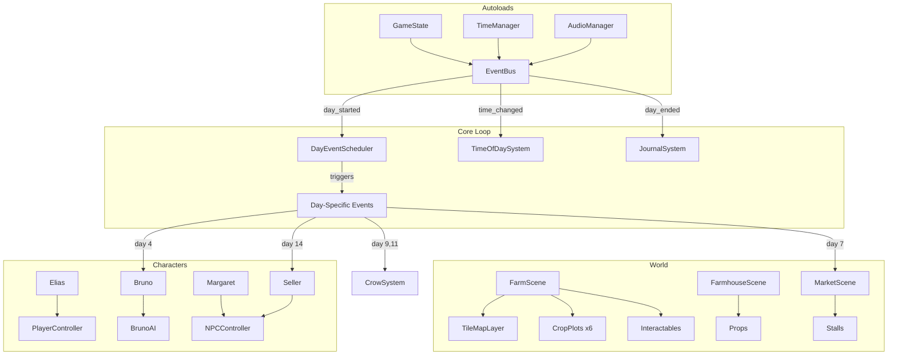
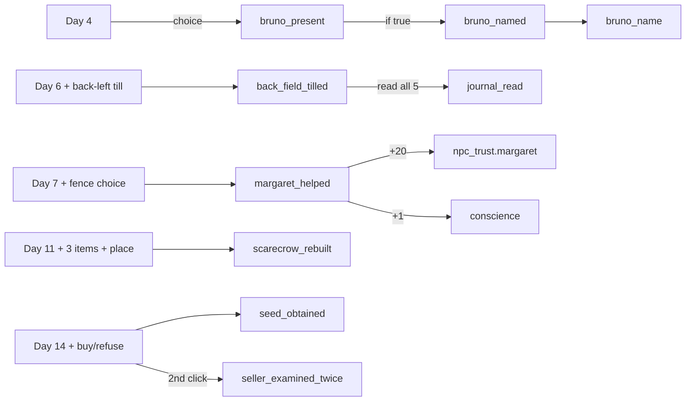

# Act 1 — Godot Implementation Plan

**Source**: Ultraplan refinement of the Act 1 story bible (`Games/PaleGarden/story/act1/`).
**Engine target**: Godot 4.x (plan says 4.3+, actual project is Godot 4.6).
**Scope**: Days 1-14, full cozy farm sim with one jumpscare (JS-01).
**Status**: Proposed plan — see [Gaps & Open Questions](#gaps--open-questions) before executing.

> **⚠ 2026-05-28 — Yard redesign in progress.** Main scene switched from
> `scenes/Main.tscn` (procedural Farm) to `scenes/world/yard.tscn`
> (hand-authored Yard with House, Magazie, BarnBody, Fence, Garden tilemaps).
> This invalidates parts of Phase 1's "Done" claims (Farm→Farmhouse transition,
> FarmhouseCollider) and the original Phase 2 prereqs assume `Farm.tscn`.
> Today's Yard-foundation work is logged in
> [[phases/phase-2-days-1-3#Yard redesign — completed 2026-05-28]].
> Read that section before treating any "Done" mark below as still true.

> **Active build pages**: [[phases/index|Phases index]] — step-by-step todo per phase, user-driven.

Related: [[../narrative/storyline-graph]] · [[../overview]] · [[../decisions]] · [[../todo]] · [[../../../../Games/PaleGarden/story/act1/act1|Story Bible Act 1]]

---

## Context

The Act 1 story bible describes 14 days of peaceful farm life that secretly sets up a horror game. This plan translates every narrative beat into concrete Godot architecture: scenes, nodes, scripts, systems, and build order. The goal is a step-by-step guide an implementer can follow without needing to interpret the story — every "the player feels X" is translated into "build Y system with Z nodes."

The game is a 2D top-down pixel art farm sim with day/night cycles, NPC interactions, journal UI, minigames, and a single jumpscare. Think Stardew Valley's structure serving Devotion's emotional arc.

---

## Architecture Overview

```
res://
├── autoload/                    # Singletons (GameState, AudioManager, TimeManager, EventBus)
├── scenes/
│   ├── main/                    # Main game scene, world container
│   ├── farm/                    # Farm tilemap, crop plots, interactables
│   ├── farmhouse/               # Interior scene (photograph, journal, bed, props)
│   ├── market/                  # Market area with stalls, NPCs
│   ├── ui/                      # HUD, journal, dialogue, inventory, title cards
│   ├── characters/              # Elias, Bruno, Margaret, Seller, Driver
│   ├── minigames/               # Fence repair
│   ├── cutscenes/               # Tea scene, JS-01
│   └── effects/                 # Weather (rain), time-of-day lighting, transitions
├── resources/
│   ├── dialogue/                # DialogueResource files (.tres)
│   ├── crops/                   # CropData resources
│   ├── items/                   # ItemData resources
│   ├── journal/                 # JournalEntry resources
│   ├── events/                  # DayEvent resources
│   └── audio/                   # AudioBus configs
├── scripts/
│   ├── autoload/                # Singleton scripts
│   ├── systems/                 # Farming, interaction, dialogue, crow, scarecrow
│   ├── components/              # Reusable node scripts (Interactable, DayAware, etc.)
│   └── data/                    # Custom Resource class definitions
├── assets/
│   ├── sprites/                 # Tilesets, characters, crops, UI elements
│   ├── audio/
│   │   ├── music/               # Piano theme, guitar theme, farm loop, market theme
│   │   ├── ambient/             # Wind, birds, crickets, rain, crows, market chatter
│   │   └── sfx/                 # Watering, harvesting, footsteps, UI sounds
│   └── fonts/                   # Pixel font, journal handwriting font
└── shaders/                     # Time-of-day tinting, rain, dew shimmer
```



---

## Build Phases

Each phase produces a playable build. Test each phase before moving to the next.

### PHASE 1 — Core Engine: The Empty World (2-3 weeks)
Elias walks around a tiled farm, enters the farmhouse, sleeps to advance days. No crops, no NPCs.

**Steps:** Project setup (480×320 resolution, input map, autoloads) → Farm TileMap (30×22) → Player character (Elias) → Farmhouse interior → Scene transitions → Day/night cycle visuals → Sleep & day advancement.

**Key autoloads created:** `GameState`, `EventBus`, `TimeManager`, `AudioManager`.

**Critical design rule:** Act 1 audio bus has NO reverb and NO bass below 200Hz. The first reverb in the game is the final F# on Day 14.

### PHASE 2 — Farming System (2 weeks)
Full crop loop: till → plant → water → grow → harvest → sell.

**Steps:** Crop data resources (tomato, carrot, sunflower, herbs) → CropPlot nodes (6 plots, 3×3 each) → Well & watering can → Harvest & gold → Crop visual growth (4-5 stages per crop).

**Day 1 tutorial overlay:** first crop plot triggers tooltips for till → plant → water; sparkle + grace note when first plot fully watered.

### PHASE 3 — Journal & Dialogue Systems (1.5 weeks)
Journal opens at night with day-specific entries; dialogue boxes with branching choices.

**JournalEntry resource:** day, text, requires_flag, alternative_text, handwriting_style (0=clean, 1-4=deteriorating for later acts).

**DialogueLine resource:** speaker, text, choices, next_line_id, set_flag, condition_flag.

**Photograph always says "Not today."**

### PHASE 4 — Audio Architecture (1.5 weeks)
Layered music: Piano (Days 1-3) → +Guitar (Day 4+) → +Percussion (Day 8+) → Quarter-note rest in loop (Day 12+).

**Morning theme:** Flamenco guitar arpeggio (x v p pattern from Addition 3).
**Farm loop:** Jazz piano ODYL motif, 72 BPM.
**Market theme:** same motif + acoustic guitar energy.

**SFX library:** till, plant, water (pour/seep/sparkle), harvest, gold clink, footsteps (grass/dirt/wood), door, bed, journal, fence repair, Bruno collar (ambient), bark.

**F# sequence (Day 14 night):** E,G,A → quarter-rest → F# (detuned, dry) → silence → "ACT 1 COMPLETE" title → silence → F# again with the only reverb in Act 1 → fade.

### PHASE 5 — Bruno (1.5 weeks)
Day 4 arrival, 10-day bonding progression, follows Elias, fetch interaction, collar sound, conditional behaviors.

**Bruno AI states:** IDLE, FOLLOWING, SLEEPING, INVESTIGATING, FETCHING, CHASING_CROWS, WAITING_AT_GATE.

**Critical:** Bruno's name input stores `bruno_name` string EXACTLY. In Act 3, the plant speaks this string verbatim. If blank, plant says "the dog" (Elias's phrase — implying it learned from him).

**Collar sound:** -25 to -30dB, looping. Player stops consciously hearing it within 2-3 days. Will notice when absent (Act 3).

### PHASE 6 — Margaret, Market & Events (2 weeks)
Market on Days 7 and 14; Margaret encounter, fence minigame, crow events, scarecrow build, bread delivery.

**Market scene** with stalls (Produce, Seed, Tool, Margaret, Seller — Seller empty on Day 7).

**Day 7 Margaret encounter:** dialogue → fence repair minigame (5 planks, drag-and-drop, Margaret's lines play during) → tea cutscene (the "we" slip).

**Bread delivery (Day 8+):** doorstep spawn daily; Bruno sniff routine.

**Crow events (Day 9: 4-5 crows; Day 11: 8-10 crows):** shoo within 3 tiles; -0.2 yield modifier on affected plots; Bruno chases.

**Scarecrow build (Day 11+):** three farm items (post, coat, straw) — already in world since Day 1 with different text. After build, crows fly away from crop edge.

**Old Journal:** tilling back-left corner → animation stutters → leather journal surfaces → single low piano note → 5 entries with deteriorating handwriting → permanently in inventory.

### PHASE 7 — Day 14: The Seller & Act 1 Finale (1.5 weeks)
Second market day, broken cart blocker, Seller encounter, JS-01, seed purchase/delivery, Act 1 title card.

**Broken cart (căruță cu cai):** blocks south exit. Driver dialogue. Unblocks after Seller encounter. Wheelwright's boy glances at Seller as he runs past — no tooltip, no prompt.

**Seller stall (north edge):** 3-tier approach detection:
- 5 tiles: ambient dips -3dB, guitar pauses 1 bar
- 3 tiles: auto-dialogue "Rare specimen."
- Direct interaction: full dialogue, max 6 words per response

**JS-01 (second interaction):** 3-frame full-screen sprite (eyes closed → open, irises too large, pale grey-green). 0.3 seconds total. Single 150Hz dry low tone, cut to silence. Pale grey-green is the **FIRST cold tone** in the entire game.

**Purchase or refuse:** either way, `seed_obtained = true` by Day 15. Refusal → seed on doorstep Day 15 morning. Gate latched from inside. Bruno sitting beside, facing away.

**Day 14 night cinematic:** journal → window pan → bed → fade to black → E,G,A → quarter-rest → F# → silence → "ACT 1 — THE GOOD LIFE — COMPLETE" → silence → softer F# with reverb → fade to Day 15.

**Day 15 morning:** Piano plays 2 notes of E-G-A then pauses where the third should be. Melody continues with a variation. Act 1 ends.

---

## Cross-Cutting Concerns

### Save System
Save on each `day_started` (autosave) to `user://save.tres`. Properties: `current_day`, `gold`, `inventory`, `planted_crops`, all `flags`.

### Palette Enforcement
22-color warm palette is a design constraint. Cold tones (blue, purple, grey-green, desaturated) reserved for Act 2+. **Only exception:** the Seller's eyes (JS-01).

### Scene Transition Map
```
Farm ←→ Farmhouse    (door, any time)
Farm  → Market       (south gate, Days 7 and 14 only)
Market → Farm        (south exit, blocked Day 14 until cart moves)
```

### Flag Dependency Graph


### What NOT to Build in Act 1
Combat/stealth, HUNGER meter (tracked internally only), demon spawning, JS-02 through JS-10, NPC sacrifice, weapon crafting, whisper audio, farmhouse transformation, cold palette (except Seller's eyes), audio reverb (except final F#), bass frequencies.

---

## Estimated Total Timeline

| Phase | Duration | Cumulative |
|-------|----------|------------|
| 1: Core Engine | 2-3 weeks | 2-3 weeks |
| 2: Farming | 2 weeks | 4-5 weeks |
| 3: Journal & Dialogue | 1.5 weeks | 5.5-6.5 weeks |
| 4: Audio | 1.5 weeks | 7-8 weeks |
| 5: Bruno | 1.5 weeks | 8.5-9.5 weeks |
| 6: Margaret/Market/Events | 2 weeks | 10.5-11.5 weeks |
| 7: Seller & Finale | 1.5 weeks | 12-13 weeks |

~3 months for polished Act 1, single developer. Phases 3 & 4 can overlap; Phases 5 & 6 partially independent.

---

# Gaps & Open Questions

The Ultraplan is well-structured but has significant blind spots. These need resolution **before implementation starts** — most are unrecoverable if discovered mid-build.

## A. Critical Conflicts with Existing Project

The plan reads as a from-scratch build, but per [[../overview]] **Act 1 already exists** with 54+ GDScript files, full scaffolding, and a working garden system. The plan never addresses this. Decisions needed:

| Existing | Plan Proposes | Conflict |
|----------|---------------|----------|
| Godot **4.6** | Godot 4.3+ | Engine version mismatch — pick one |
| Resolution **640×360**, 32px tiles | 480×320, 16px tiles | All existing sprites are wrong size |
| Garden grid **8×6** | Farm 30×22 with 6 plots of 3×3 | Complete layout incompatibility |
| Autoloads: `Constants`, `GameState`, `DayManager`, `AudioManager`, `DialogueManager`, `MCPGameBridge` | `GameState`, `AudioManager`, `TimeManager`, `EventBus` | Plan deletes 3 existing autoloads, adds 2 new ones |
| Content in `content/*.json` (hard rule in CLAUDE.md) | Content in `resources/*.tres` | Violates the project's stated architecture |
| Save via `ConfigFile` at `user://save.cfg` | Resource at `user://save.tres` | Format change loses any existing saves |
| Stamina system **5/day** | Not mentioned | Plan ignores a core mechanic |
| CanvasLayer: HUD=5, GardenOverlay=10, DialogueBox=10, DayTransition=15 | HUD layer 5, Transition 10, JS-01 layer 20 | Reordering may cause z-order bugs |
| Existing minigames: PlantingMinigame, MarketBartering, FenceRepair, ScarecrowAssembly, PlankPuzzle | Plan describes Fence Repair as if new | Existing implementations not referenced |

**Decision required:** Refactor existing code to match plan, or rewrite plan to match existing architecture? This is the single biggest gap.

## B. Story-Bible Contradictions Within the Plan

- **Crow color**: plan says crows are "black with a blue-green sheen" — but blue-green is a **cold tone explicitly reserved for Act 2+**. Contradicts the palette enforcement rule in the same plan.
- **JS-01 frame timing**: plan says "3 frames at 0.1s each = 0.3s" but doesn't specify framerate. At 60fps that's 18 actual frames; at 30fps that's 9. Pick one.
- **Day duration**: 240 seconds (4 min) × 14 days = 56 min total, but Day 1 alone is "first 10 minutes" for tutorial. Math doesn't work.
- **Reverb exception**: plan says "no reverb in Act 1" but adds slight reverb to final F#. The audio bus architecture has no mechanism for selective reverb (single bus = single effect chain). Needs implementation note.

## C. Missing Systems Entirely

- **Main menu / title screen** — game starts where?
- **Settings menu** — audio sliders, controls remapping, accessibility
- **Pause menu** — what happens on Escape during gameplay?
- **Quit/save-on-exit flow** — mid-day save? Lose progress?
- **Inventory UI** — referenced but no scene structure provided
- **Energy system** — "+2 energy" from bread mentioned, never defined
- **Localization framework** — Bruno name input accepts what character set? Profanity filter? UTF-8?
- **Accessibility** — colorblind safe palette? Text size scaling? Subtitle toggle?
- **Credits screen**
- **Loading screen** between scene transitions

## D. Narrative/Design Gaps

- **Tea cutscene scope undecided**: "static illustrated screen or simple scene" — pick one, the asset budget is very different.
- **Bruno's farm investigation**: "5-minute timer" — what does the player do during this? Just watch? Can they interact?
- **Day 12's "particular light quality"**: how does this differ visually from other afternoons? Needs concrete shader values.
- **Day 13 evening porch scene**: described emotionally but no implementation steps — is it a cutscene? Player-controlled? How is the "stay as long as they want" enforced/encouraged?
- **Photograph evolution**: "Not today" forever in Act 1 — but later acts presumably change this. The plan doesn't establish the hook for later transformation.
- **Margaret's "we" pause timing**: "she catches herself" — how long is the pause? Is there an SFX? Visual cue?

## E. Player Choice Edge Cases

- What if player **skips/ignores the Day 1 tutorial**? Can they figure it out? Does it re-prompt?
- What if player **never tills the back-left corner**? Old journal stays buried forever — Act 2+ planted seed assumes the corner is tilled.
- What if player has **<5 gold on Day 14**? Can't buy seed. Plan says "seed always arrives Day 15 on doorstep if refused" — does this also apply to "can't afford"?
- What if player **doesn't go to market on Day 7**? South gate auto-closes? Margaret encounter happens later? The plan doesn't say.
- **Bruno name input validation**: max length? Special characters? Emojis? Empty submit (currently → "the dog")?
- What if player **shoos Bruno on Day 4**? Several Day 5-14 events reference Bruno-present behaviors. Need parallel branch for Bruno-absent.

## F. Asset/Production Gaps

- **22-color palette is mentioned but never enumerated** — needs an actual swatch file with hex values.
- **Sprite dimensions inconsistent**: Elias is "16×16 or 16×24" — pick one, all animations break otherwise.
- **No reference to existing sprite pipeline** ([[../decisions|decisions]] mentions LoRA-trained Elias sprites at 32×48 — plan ignores).
- **Music sources unspecified**: Addition 3 gives Virtual Piano notation; who turns this into actual `.ogg`/`.wav` files? Composer? AI-generated?
- **Pale grey-green eye color**: "#A8B5A0 or similar" — needs definitive hex, this is the most important color in Act 1.
- **Pixel handwriting font**: 4 deterioration variants needed but no source.

## G. Engineering Gaps

- **No test plan** — unit tests? Integration tests? Headless playthrough script?
- **No version control branching strategy**
- **Performance targets unspecified** — 60fps target? Min spec hardware?
- **Platform targets unspecified** — Windows only? Steam? itch.io?
- **Save/load mid-day** — plan only autosaves on day_started. Quit during Day 7 fence minigame = lose progress?
- **Multiple save slots** — single slot is "fine for Act 1" but Act 5 has 5 endings. When do slots get added?
- **No CI/build pipeline**

## H. Integration with Existing Toolchain

The plan doesn't mention:
- **Godot MCP** (`@satelliteoflove/godot-mcp` on port 6550) — mandatory per [[../overview]]
- **Skills**: `godot-ui` + `godot-gdscript-patterns` (must be read before code)
- **10 gamedev agents** at `Games/.claude/agents/gamedev/` — director, architect, coder, etc. Plan is single-developer-oriented; ignores agent workflow
- **`MCPGameBridge` autoload** — exists in current project, plan doesn't address removal or integration

## I. What Carries Forward to Acts 2-5 (Not Established)

These Act 1 elements need hooks for later act transformations — the plan establishes them but doesn't tag them for future change:

- **Farmhouse props** (photograph, dusty cup, second chair, bookshelf) — Act 2-5 transformations not scoped
- **Bruno's collar sound** — disappearance event in Act 3 needs precise audio cue timing
- **Crow ambient absence after Day 14** — atmospheric signal in Act 2, needs system to suppress crow audio
- **Quarter-note rest in music loop** — Act 2 fills this with F#/whispers; the music architecture needs to support audio injection into that specific gap
- **Journal handwriting style 0** (clean) — Act 2-5 progresses to styles 1-4; the rendering system must support all 5 variants now, not retrofitted later

## J. Timeline Realism

3 months for one developer is aggressive given:
- Act 1 already exists in some form (refactor cost not budgeted)
- Music composition not budgeted
- Sprite art for 5+ characters, 4 crops × 5 stages, tilesets, UI not budgeted
- Voice acting? Sound effects sourcing? Both unbudgeted
- Polish/QA pass not budgeted
- Realistic estimate with art/audio: 5-7 months

---

## Recommendations Before Starting

1. **Reconcile with existing project** (Section A) — this is the blocker
2. **Define the 22-color palette as an actual file** (Section F)
3. **Decide tea cutscene scope** (Section D) — affects asset budget
4. **Spec all edge-case branches for Bruno-absent path** (Section E)
5. **Add main menu, settings, pause, save-load to scope** (Section C)
6. **Write the Acts 2-5 hook list** so Act 1 implementations include the right extension points (Section I)

Once these are answered, Phase 1 can start with confidence.
